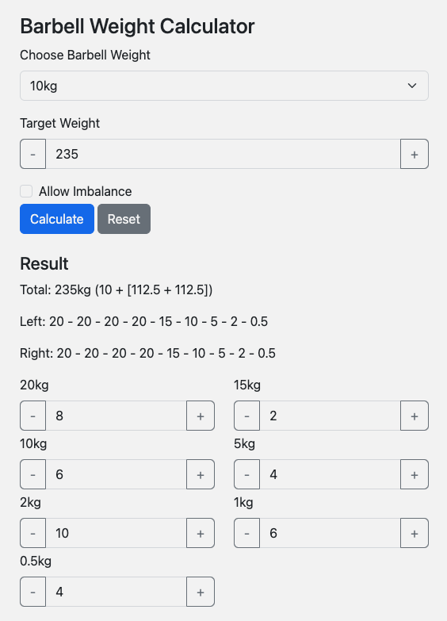

# Barbell Load Calculator

How the hell did you end up here?

Since I'm dumber than usual during training, this is a simple calculator to assist my brain with broscience calculations for loading barbells/dumbbells. So, why is this even public? Just because this way, GitHub Pages allows me to host it for free.

[Try it out](https://alainrk.github.io/barbell-loader/). [Want to use it? Need features?](https://github.com/alainrk/barbell-loader/issues)

