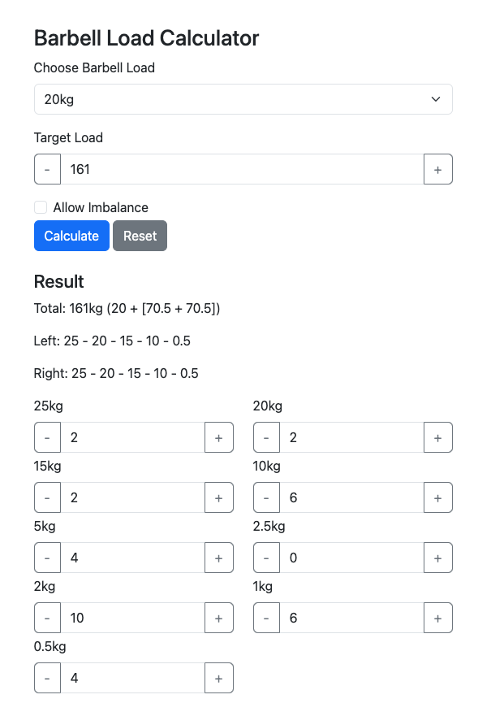

# Barbell Loader Calculator

Why are you even reading this?

Since I'm even dumber than usual during training, this is a simple calculator to assist my brain with broscience calculations for loading barbells/dumbbells. So, why is it even public? Just because this way, Github Pages allows me to host it for free.

